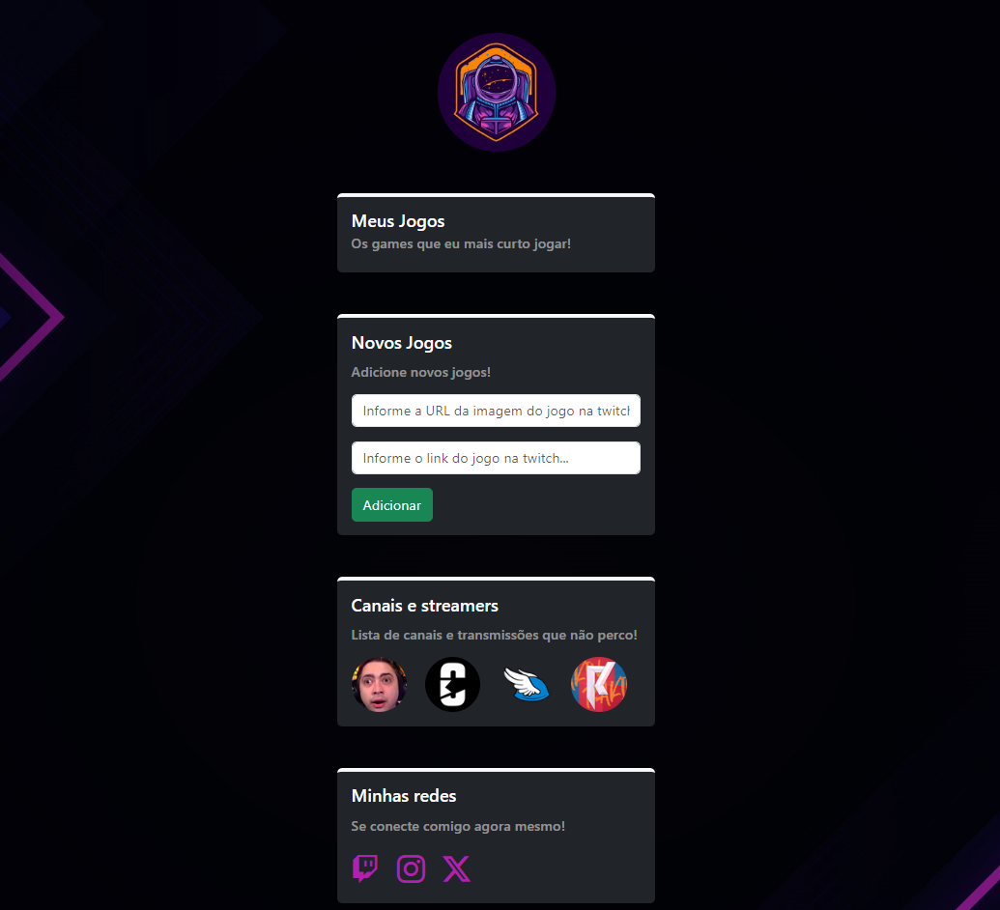

<h1 align="center">Trabalho final de Git/GitHub</h1>

    <a href="#-descrição">Descrição</a>&nbsp;&nbsp;&nbsp;|&nbsp;&nbsp;&nbsp;
    <a href="#%EF%B8%8F-tecnologias">Tecnologias</a>&nbsp;&nbsp;&nbsp;|&nbsp;&nbsp;&nbsp;
    <a href="#-acesso">Acesso</a>&nbsp;&nbsp;&nbsp;|&nbsp;&nbsp;&nbsp;

    

> A imagem representa uma versão ainda em desenvolvimento!

<h2>📄 Descrição</h2>
Projeto final realizado para a matéria de Git/GitHub da Pós-graduação em desenvolvimento WEB com frameworks modernos

<h2>⚙️ Tecnologias</h2>

- HTML
- CSS
- Bootstrap

<h2>🌐 Acesso</h2>

[🔗 Clique aqui para acessar ](https://www.google.com.br/)